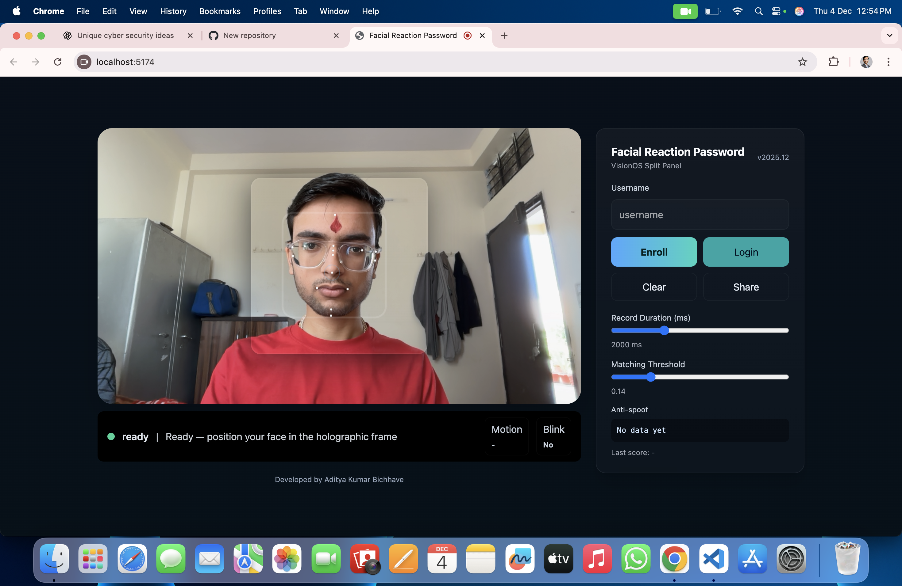

  

🧠 Facial Reaction Password (FRP)

A next-generation biometric authentication system that identifies users using facial micro-reactions, blinking behavior, and natural movement patterns.

Unlike traditional passwords or face-recognition systems, FRP records your reaction sequence (blink → smile → slight head movement, etc.) and uses AI to verify it.
It works using any standard webcam — no specialized hardware needed.

🚀 Features
🔹 Real-Time Facial Landmark Tracking

Powered by MediaPipe Face Landmarker, detecting 468+ facial points with high precision and low latency.

🔹 Reaction-Based Password (Instead of Text Passwords)

Users perform a natural facial sequence which becomes the unique password template.

🔹 AI Matching Using Dynamic Time Warping (DTW)

DTW compares two sets of motion-based landmark sequences to determine user identity.

🔹 Anti-Spoofing System

Detects and blocks fake login attempts using:

Motion variance

Blink detection

Micro-movement consistency

Landmark noise analysis

🔹 Secure Local Storage

User facial templates are stored as numerical vectors, not images.
Supports:

LocalStorage (frontend-only mode)

Express backend storage (optional)

🔹 Beautiful VisionOS-Inspired UI

Premium holographic design featuring:

Floating glass panels

Sleek motion indicators

Real-time metrics

Minimalistic control panel

🛠️ Tech Stack
Frontend

React (Vite)

TailwindCSS

MediaPipe Tasks Vision

Canvas API

Backend

Node.js + Express

Local JSON template storage
(Upgradable to MongoDB / Firebase easily)

Other Tools

Dynamic Time Warping (DTW)

LocalStorage caching

Web Share API

📸 Demo Preview

Replace screenshot.png with your actual screenshot

📦 Folder Structure
facial-reaction-password/
│
├── backend/
│   ├── server.js
│   ├── package.json
│
├── frontend/
│   ├── public/
│   ├── src/
│   │   ├── components/
│   │   │   ├── FacialReactionPassword.jsx
│   │   │   ├── FacialReactionPasswordVision.jsx
│   │   ├── App.jsx
│   │   ├── main.jsx
│   ├── package.json
│
├── README.md
└── .gitignore

⚙️ Installation & Setup
1️⃣ Clone Repository
git clone https://github.com/adityabichhave/facial-reaction-password.git
cd facial-reaction-password

🎨 Frontend Setup (React + Vite)
cd frontend
npm install
npm run dev

Frontend starts at:
👉 http://localhost:5173

🧩 Backend Setup (Node.js + Express)
cd backend
npm install
npm run dev

Backend runs at:
👉 http://localhost:5001

🔐 How Authentication Works

FRP records 468+ facial landmarks across multiple frames

Normalizes vectors around the face center

Creates a unique reaction pattern

Runs DTW to compare sequences

Applies anti-spoofing checks

Computes similarity score

Accepts or rejects login based on threshold

🧪 API Endpoints (Backend Optional)
POST /api/enroll

Stores a user’s facial reaction template.

GET /api/template/:username

Retrieves stored template for login matching.

🔒 Security Notes

✔ No raw video or images are stored
✔ Templates contain only floating-point vectors
✔ Works completely offline
✔ Users control their own data
✔ Backend storage is optional

🌍 Real-World Applications

Passwordless authentication

Secure workstation login

High-security lab access

Personal computer unlocking

Research in biometrics & AI

Gesture-based UI systems

Human-computer interaction studies

🤝 Contributing

Pull requests are welcome!
Open issues for:

UI/UX improvements

Performance tuning

Model optimization

Security enhancements

📜 License

This project is licensed under the MIT License — free to use and modify.

👨‍💻 Developed By
Aditya Kumar Bichhave

B.Tech CSE | Cyber Security Enthusiast | Full-Stack Developer
